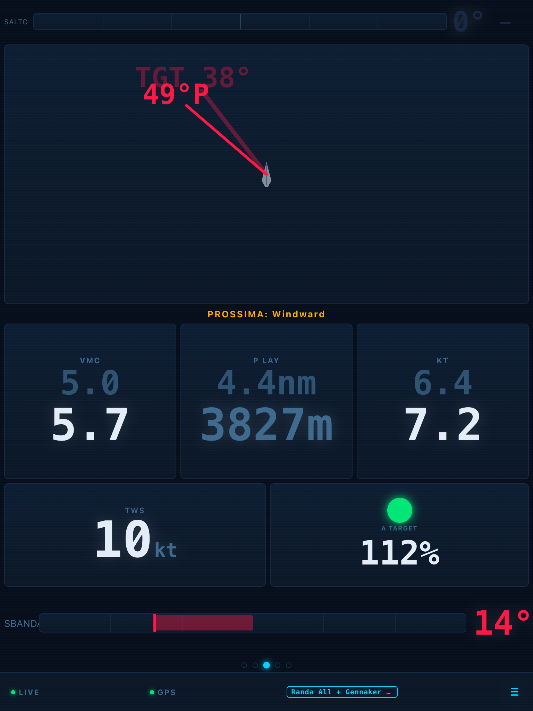
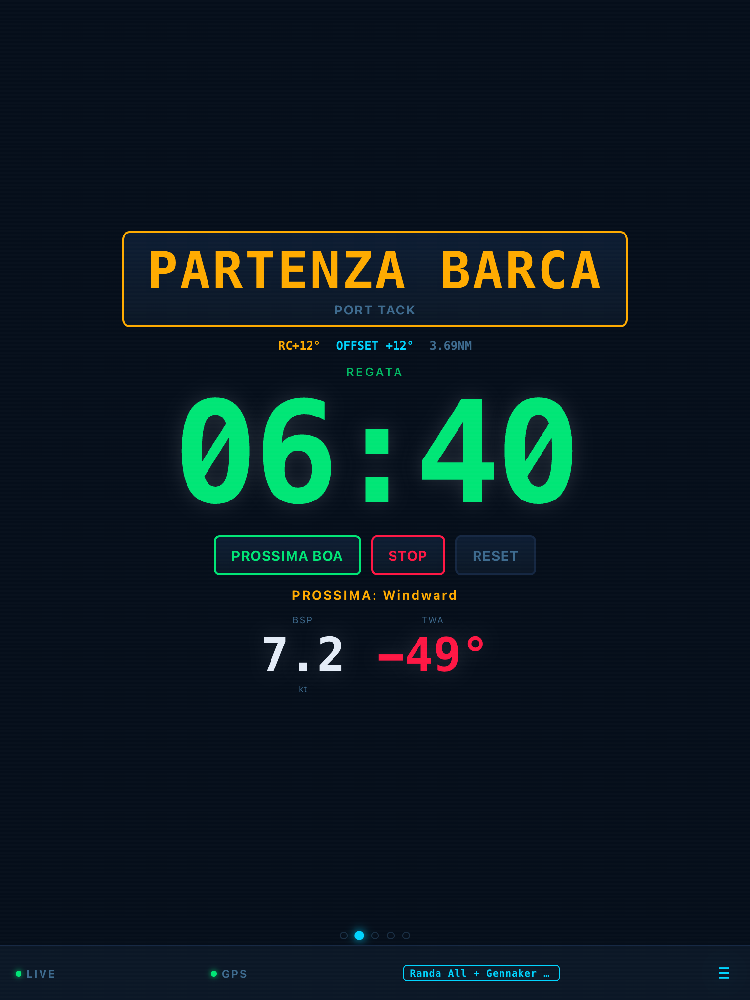
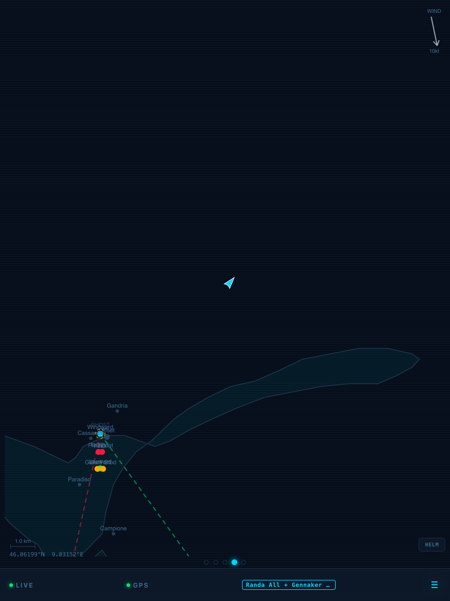
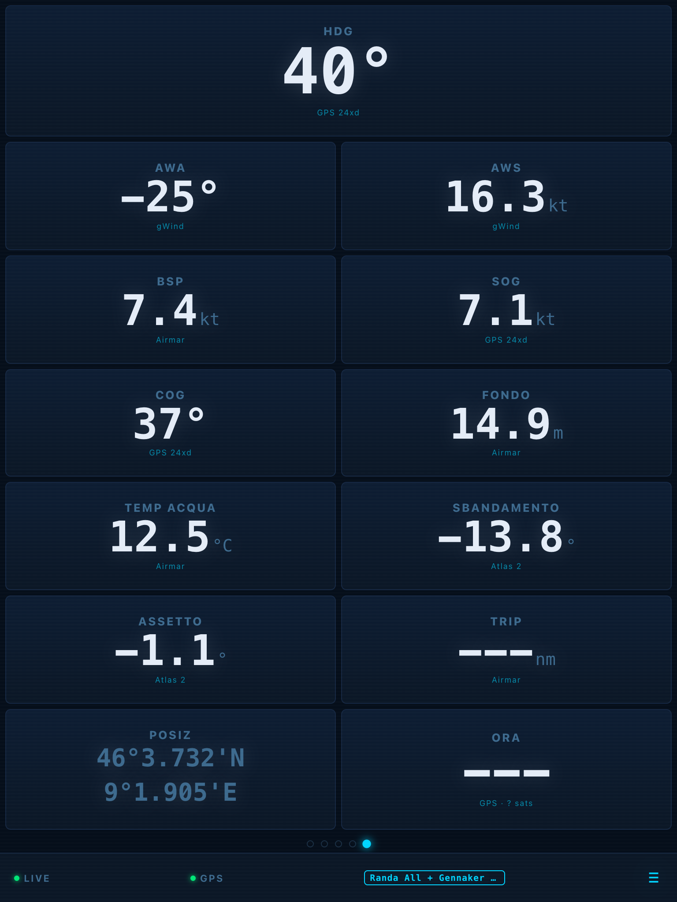
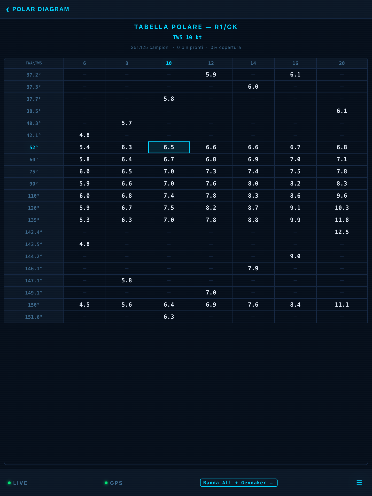
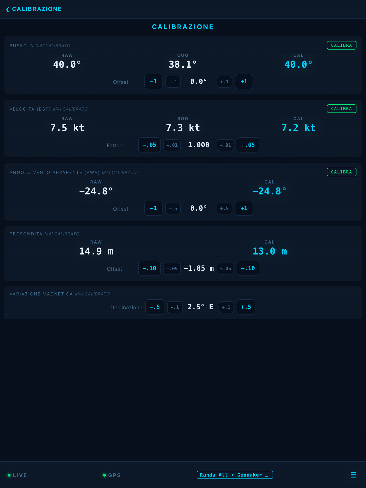

# Aquarela

Open-source sailing instrument and performance system for NMEA 2000 boats.

Aquarela runs on a Raspberry Pi connected to the boat's CAN bus, reads all instrument data, applies calibrations and wind corrections, and serves a real-time dashboard accessible from any device on board. A companion Android app provides offline session review with track maps and maneuver analysis.

<p align="center">
  
  
  
</p>
<p align="center">
  
  
  
</p>

## Architecture

```
Boat instruments (wind, GPS, speed, depth, attitude)
    |  NMEA 2000 / CAN bus (250 kbps)
    v
Raspberry Pi + CAN HAT
    |  source_can.py (PGN decode, fast-packet reassembly)
    v
Pipeline: calibration -> wind correction -> true wind -> derived fields
    |
    +---> WebSocket broadcast (real-time)
    +---> CSV logger (2 Hz, 42 columns)
    +---> CAN writer (calibrated data back to Garmin displays)
    |
    v
Svelte dashboard (served at :8080)  +  Android companion app
```

## Features

### Sailing instruments
- Upwind / downwind displays with targets from polar curves
- Wind rose (AWA + TWA combined)
- Navigation page (heading, COG, bearing/distance to waypoint)
- Raw sensor readings grid

### Race tactics
- Race timer with start line bias
- Course setup with Lake Lugano presets
- Layline calculator
- VMG and VMC performance tracking
- Wind shift detection and history

### Performance
- Polar diagram with per-sail curves
- Auto-learning polars from sailing data
- Auto-calibration (compass, speed, AWA via tack symmetry)
- Wind upwash correction with self-learning tables
- Heel correction (geometric mast projection)

### Sail & trim
- Sail inventory management (main, jib, genoa, gennaker configs)
- Trim book with historical entries
- Trim guidance by wind conditions

### Session recording
- Auto-start/stop based on boat movement
- CSV logging (42 columns, Njord Analytics compatible)
- Maneuver detection (tacks, jibes) with performance metrics
- SQLite database for session metadata

### CAN bus integration
- Reads 12+ NMEA 2000 PGNs including fast-packet
- Writes calibrated data back as NMEA 2000 (wind, heading, speed, depth)
- ISO address claim + product info for Garmin device discovery
- Source address filtering to prevent double correction

### Android companion app
- Auto-discovers Pi via WiFi hotspot
- Live data view (embedded WebView)
- Offline session browser with track maps (osmdroid)
- Maneuver markers with distance lost per tack/jibe
- CSV session download
- OTA software updates (downloads from GitHub, uploads to Pi)

## Tech stack

| Component | Technology |
|-----------|-----------|
| Backend | Python, FastAPI, uvicorn, python-can |
| Frontend | Svelte 4, Vite |
| Android | Kotlin, Jetpack Compose, Room, osmdroid |
| Database | SQLite (aiosqlite) |
| Hardware | Raspberry Pi + CAN HAT, SocketCAN |

## Quick start

### On the Pi

```bash
# Install dependencies
sudo apt install python3-pip python3-venv nodejs npm can-utils

# Clone and setup
git clone https://github.com/tommymancer/regata-software.git
cd regata-software
python3 -m venv venv
source venv/bin/activate
pip install -e .

# Build frontend
cd frontend && npm install && npm run build && cd ..

# Run (simulator mode for testing)
python -m uvicorn aquarela.main:app --host 0.0.0.0 --port 8080
```

Open `http://localhost:8080` in a browser.

### Deploy to Pi from Mac

```bash
./deploy.sh
# Auto-detects Pi at aquarela.local or 10.42.1.1
# Builds frontend, syncs files, restarts service
```

### OTA update from Android

The Android app can update the Pi software without a computer:
1. Open the app, connect to Pi
2. Go to **Impostazioni** tab
3. Press **Aggiorna Pi da GitHub**

The phone downloads the update via cellular and uploads it to the Pi over the local WiFi.

## Network

| Interface | Address | Purpose |
|-----------|---------|---------|
| wlan0 (hotspot) | 10.42.0.1 | Phone/tablet connects here |
| eth0 (router) | DHCP | Home network access |
| eth0 (direct) | 10.42.1.1 | Mac direct connection |
| can0 | 250 kbps | NMEA 2000 instruments |

WiFi SSID: **Aquarela** / Password: **aquarela1**

Dashboard: `http://10.42.0.1:8080` (on boat) or `http://aquarela.local:8080` (via router)

## Supported instruments

Tested with Garmin marine electronics on a Nitro 80:
- Garmin GNX 20/21 displays
- Garmin gWind wireless wind sensor
- Garmin GPS 24xd
- Airmar SmartTRI (speed, depth, water temp, attitude)

### NMEA 2000 PGNs decoded

| PGN | Description |
|-----|-------------|
| 126992 | System Time |
| 127250 | Vessel Heading |
| 127257 | Attitude (heel, trim) |
| 127258 | Magnetic Variation |
| 128259 | Speed (water referenced) |
| 128267 | Water Depth |
| 128275 | Distance Log |
| 129025 | Position Rapid Update |
| 129026 | COG & SOG |
| 129029 | GNSS Position |
| 129540 | GNSS Satellites in View |
| 130306 | Wind Data |
| 130310/130311 | Environmental Parameters |

## Project structure

```
aquarela/              Python backend
  main.py              FastAPI app, WebSocket, pipeline loop
  config.py            Configuration management
  nmea/                CAN bus reading, PGN decoding, CAN writer
  pipeline/            Calibration, true wind, upwash, damping
  api/                 REST endpoints (race, polars, sails, sessions)
  race/                Timer, start line, course setup, navigation
  performance/         Polars, auto-calibration, laylines, VMC
  training/            Maneuver detection, sessions, trim book
  logging/             CSV logger, SQLite database
  static/              Built frontend assets

frontend/              Svelte dashboard (17 pages)
aquarela-android/      Kotlin companion app
tests/                 pytest test suite
data/                  Runtime data (config, polars, sessions)
docs/                  Boat, electronics, and product documentation
deploy.sh              Build and deploy to Pi
```

## Tests

```bash
python3 -m pytest tests/ -q
```

## License

All rights reserved.
